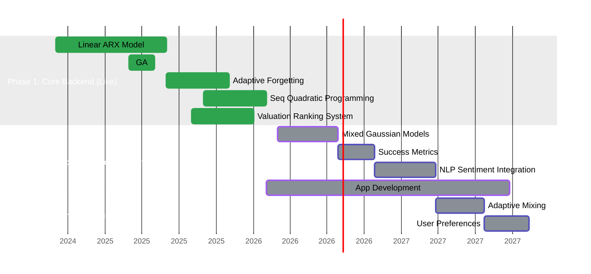

```mermaid
%%{init: { 
  'themeVariables': {
    'primaryColor': '#7A7A7A',
    'primaryTextColor': '#24292e',
    'primaryBorderColor': '#d1d5da',
    'lineColor': '#f03a17',
    'secondaryColor': '#fff',
    'tertiaryColor': '#fff',
    
    'titleColor': '#fff',
    'sectionBkgColor': '#A1A1A1',
    'sectionBkgColor2': '#fff',
    
    'taskBkgColor': '#898F96',
    'taskTextLightColor': '#24292e',
    
    'doneTaskBkgColor': '#2ea44f',
    'doneTaskBorderColor': '#2ea44f',
    
    'activeTaskBkgColor': '#898F96',
    'activeTaskBorderColor': '#A15CF2'
  }
} }%%
gantt
    title Portfolio Optimization Roadmap
    dateFormat  YYYY-MM-DD
    axisFormat  %Y
    
    section Phase 1: Core Backend (Live)
    Linear ARX Model           :done,    des1, 2024-09-01, 2025-06-01
    GA                         :done,    des2, 2025-03-01, 2025-05-01
    Adaptive Forgetting        :done,    des3, 2025-06-01, 2025-11-01
    Seq Quadratic Programming  :done,    des4, 2025-09-01, 2026-02-01
    Valuation Ranking System   :done,    des5, 2025-08-01, 2026-01-01

    section Phase 2: Advanced Intelligence (Next)
    Mixed Gaussian Models      :active,    p2a, 2026-03-01, 150d
    Success Metrics            :           p2b, after p2a, 90d
    NLP Sentiment Integration  :           p2c, after p2b, 150d
    App Development            :active,    p2d, 2026-02-01, 600d

    section Phase 3: Convergence (Future)
    Adaptive Mixing            :         p3a, after p2c, 120d
    User Preferences           :         p3b, after p3a, 110d
```
